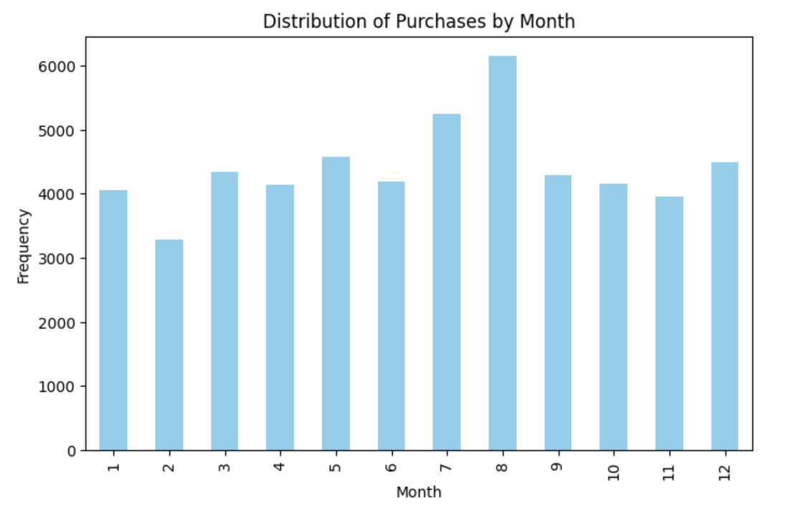
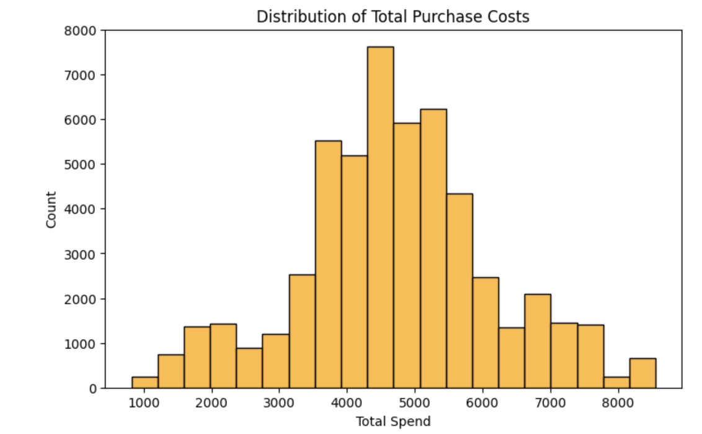
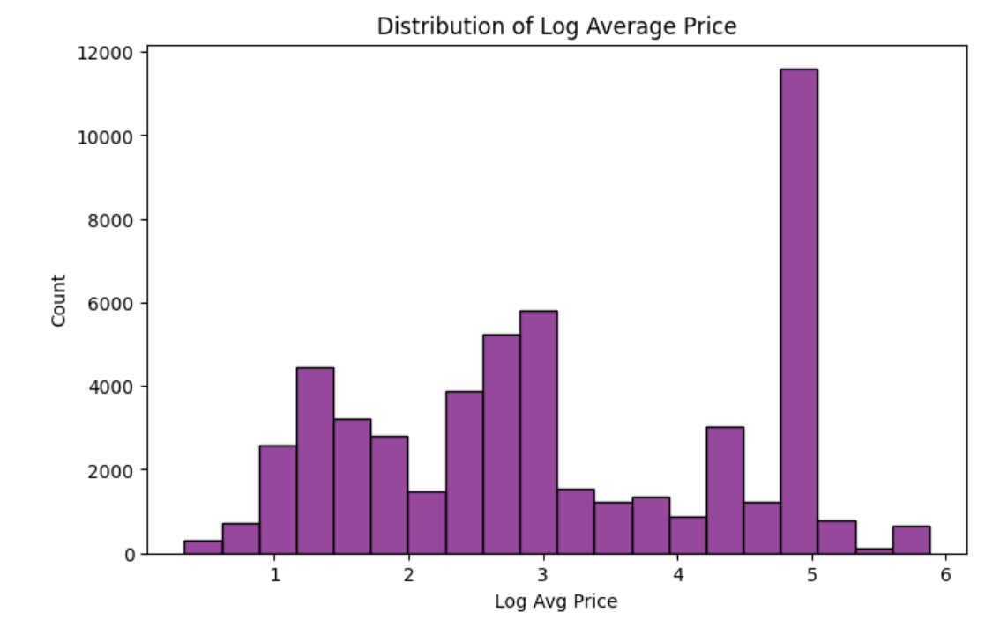
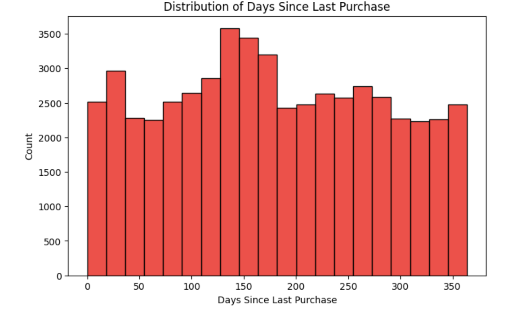
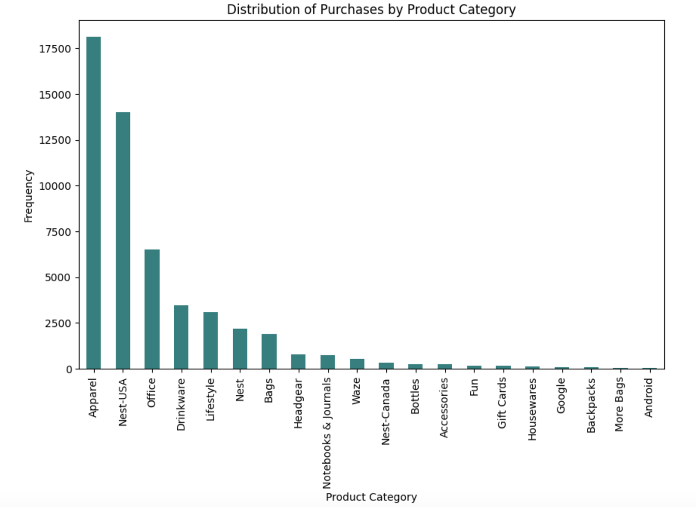

# CSE-150A-Group-Project

## Our Agent
We are working on the same task from the previous two milestones, hoping to use a new model that produces better results. The main goal of our `CustomerPurchaseAgent` is to use past retail transaction data for a particular customer and be able to provide relevant recommendations for that customer's future purchasing activity based on probabilistic reasoning. Our agent takes in raw retail transactions and transforms those purchases into meaningful features (such as the log-transformed total purchase, the purchase frequency, and the total items bought). Our agent then uses a trained HMM that is trying to identify underlying temporal patterns in customer behavior; the time periods on which the model gets trained varies are months. Then, based on the trained model, the agent tries to predict the purchasing behavior of a given customer and to influence the purchasing behavior of a given customer by providing reasonable recommendations for future purchases. In practice, the agent
* uses a set of conditional probability tables (CPTs) to understand relationships between some of the key variables in the retail transactional data for a given customer,
* uses a trained Hidden Markov Model (HMM) to predict potential purchases for a given customer,
* uses the predicted hidden states from the model and the CPTs to propose purchasing recommendations for a given customer at a particular time.

The main CPTs our agent incorporates into its prediction and recommendation stage are: 
* `P(Product_Category \| CustomerID)`, denoting the probability of each product category given a customer,
* `P(Total_Spend \| CustomerID, Purchase_Month)`, denoting the probability of spending a particular amount by a customer in a particular month,
* `P(Avg_Price \| CustomerID, Product_Category)`, denoting the probability of paying an average price for a given customer for items in a particular category,
* `P(Days_Since_Last_Purchase \| CustomerID)`, denoting the probability of a certain number of days elapsing since a given customer last made a purchase, and 
* `P(Used_Coupon \| CustomerID, Product_Category)`, denoting the rrobability that a customer uses a coupon for a given category.

These CPTs help govern the prediction and recommendation stage for our agent, as well as being a part of our model (see ['Technical Discussion of Model' section](#technical_discussion_of_model) for more detail). Our agent is goal-based: we want it to able to take in a CustomerID and, perhaps given some more information, return some kinds of purchases a customer may be interested in at a particular time and return some purchasing recommendations for the customer. In code, our `CustomerPurchaseAgent` class has two key methods (aside from the constructor, which is somewhat self-explanatory): 
```
class CustomerPurchaseAgent:
    """
    CustomerPurchaseAgent class designed to:
    - Predict potential purchases for a given customer based on CPTs and trained HMM model.
    - Provide personalized recommendations tailored to the customer's behavior.
    - Evaluate performance by comparing predictions with actual purchase data.

    Methods:
    - predict_purchases(): Predicts categories, spending, and purchase behavior for a customer.
    - recommend_purchases(): Provides tailored recommendations based on known conditions.
    """
```
The constructor for our `CustomerPurchaseAgent` class allows us to initialize our agent by giving it a trained HMM model, our set of CPTs, and the dataset from which it can try and make predictions and recommendations. (The reason for including the dataset here is that it would allow for us to more easily compare the results of our agent's predictions against some of the actual purchases made by a given customer.) The PEAS for our agent remain consistent with our previous milestones, with some small changes: 
* Performance Measure: accuracy, which denotes the percentage of the predictions that match actual purchasing behvaior of a customer^*predicted states that match the hidden states of a customer's purchase.
* Environment: the current time-based data using transaction dates and other purchasing information like total amount spent, product categories, amongst other pieces of information.
* Actuators: the months in which customers purchased items, and the purchase categories those items would fall under.
* Sensors: processed retrail transactional data that the HMM model is trained on; the data includes variables like the total purchase amount spent, the customer's ID, the kind of purchase made, if a coupon was applied, etc.


## Data Processing and Model Setup
We found that our previous datasets were not as tailor-made for such a project as we would have liked, so we began working with a new dataset that seems to be more suited for this kind of project. The Kaggle dataset can be found at [this link]([/guides/content/editing-an-existing-page#modifying-front-matter](https://www.kaggle.com/datasets/jacksondivakarr/online-shopping-dataset?resource=download.)), and it includes a detailed record of customer purchase behavior across various transactions; its list of variables is: 

| **Variable**               | **Description**                                               | **Data Type** |
|----------------------------|---------------------------------------------------------------|----------------|
| `CustomerID`                | Unique identifier for each customer.                          | Numeric         |
| `Gender`                    | Gender of the customer (e.g., Male, Female).                   | Categorical     |
| `Location`                  | Location or address information of the customer.               | Text            |
| `Tenure_Months`             | Number of months the customer has been associated.              | Numeric         |
| `Transaction_ID`            | Unique identifier for each transaction.                        | Numeric         |
| `Transaction_Date`          | Date of the transaction.                                        | Date            |
| `Product_SKU`               | Stock Keeping Unit (SKU) identifier for the product.            | Text            |
| `Product_Description`       | Description of the product.                                      | Text            |
| `Product_Category`          | Category to which the product belongs.                          | Categorical     |
| `Quantity`                  | Quantity of the product purchased.                              | Numeric         |
| `Avg_Price`                 | Average price of the product.                                    | Numeric         |
| `Delivery_Charges`          | Charges associated with the delivery of the product.             | Numeric         |
| `Coupon_Status`             | Status of the coupon associated with the transaction.            | Categorical     |
| `GST`                       | Goods and Services Tax associated with the transaction.         | Numeric         |
| `Date`                      | Date of the transaction (potentially redundant with `Transaction_Date`).| Date        |
| `Offline_Spend`             | Amount spent offline by the customer.                            | Numeric         |
| `Online_Spend`              | Amount spent online by the customer.                             | Numeric         |
| `Month`                     | Month of the transaction.                                         | Categorical     |
| `Coupon_Code`               | Code associated with a coupon, if applicable.                     | Text            |
| `Discount_pct`              | Percentage of discount applied to the transaction.                 | Numeric         |

Not all of these variables are particularly relevant to our model, but it felt somewhat relevant to do a little bit of feature engineering. We add the following columns to our data: 
- `Days_Since_Last_Purchase` — Introduced to better track customer engagement cycles.
- `Purchase_Month` — Extracted from `Transaction_Date` to model seasonal trends.
- `Used_Coupon` — Binary feature representing whether a coupon was redeemed.
- `Discount_Applied` — Binary feature representing whether a discount was applied in the transaction.

These features will be useful for the Conditional Probability Tables (CPTs) that will contribute to our models and to our agent's ability to make good predictions and to provide reasonable recommendations for a particular customer. In addition to adding these columns, we rescale some of the columns so that the data are less susceptible to outliers and to increased variability. For some of the relevant features of the data, we include some plots that give us a visual interpretation for our data: 







From these features (also known as variables) are the important ones that we will focus on for our model. For our agent, we figured it would be more than reasonable for it to try and predict a customer's purchasing patterns and try and promote certain purchasing behavior by considering the total amount a customer spent, when they spent it (purchasing month), the kinds of items they purchased (i.e., product categories), and how long it had been (in days) since that customer's previous purchase. In looking at total amount spent, a higher value would indicate to our agent that a recommendation might include the suggestion for buying more items; similarly, if the average price (in log-scale) of the items a customer bought was on the higher end (we use the log to reduce variability and to condense the dataset), the agent might also recommend more spending splurges. On the other hand, considering when a customer bought an item (the transcation or purchasing month) gives some insight into when that customer might be keen on purchasing items. Likewise, the categorization of the items bought by the particular customer provide insights into that customer's preferences. These principal variables offer some interesting delineations in the data for our agent. For example, variables like `CustomerID`, `Product_Category`, and `Total_Spend` make purchasing patterns customer specific, while features like `Purchase_Month` and `Days_Since_Last_Purchase` reveal time-based dependencies. Other binary variables like `Used_Coupon` and `Discount_Applied` (for which we do not have graphs because of their possible values but for which we make use of in our agent), influence both spending behavior and category preferences. (To that end, consider an electronic market for which there might be few discounts compared to a clothing market for which discounts might be plentiful. That affects a customer's purchasing behavior.) 


### Generating our Conditional Probability Tables<a id='generating_our_conditional_probability_tables'></a>
Having described some of the main variables our agent will be relying on, we now look at the CPTs that our agent uses. In order to calculacte those CPTs, we used specific formula which were dependent on the data associated with those CPTs. Specifically, each CPT is calculated using grouped frequency counts, means, or normalized probabilities. For CPTs based on categorical probabilities:  

$$ \mathbb{P}(X \,|\, Y) = \frac{\text{Count of } X \text{ in group } Y}{\text{Total observations in group } Y} $$

As an example, consider the probability of a given customer purchasing an item from a specific category:
```python
cpt_productCategory_by_customer = data.groupby('CustomerID')['Product_Category'].value_counts(normalize=True).unstack(fill_value=0)
```

For CPTs based on continuous values like `Avg_Price`, `Quantity`, or `Total_Spend`:  

$$ P(X \,|\, Y) = \frac{\sum_{x'} \text{count } X = x'}{\text{count of observations of } Y} $$

As an example, consider the probability of a given customer purchasing an item in a given product category:
```python
cpt_price_by_customerAndProductCategory = data.groupby(['CustomerID', 'Product_Category'])['Avg_Price'].mean().unstack(fill_value=0)
```

For binary features (e.g., `Used_Coupon`, `Discount_Applied`), probabilities are computed as:

$$ \mathbb{P}(X = 1 \,|\, Y) = \frac{\text{Count of Successful Outcomes for }X}{\text{Total Observations in Group} Y} $$

As an example, consider the probability that a given customer uses a coupon to buy an item from a specific product category:
```python
cpt_coupon_by_customerAndProductCategory = data.groupby(['CustomerID', 'Product_Category'])['Used_Coupon'].mean().unstack(fill_value=0)
```
(We add that we were able to get LaTex expressions here in our ReadMe file by using the same expressions in our Jupyter Notebook; through practice writing up LaTex expressions during homework or on the in-class notebooks, we get the same expressions here.) In order to make use of the `Product_Category` and the `Total_Spend` variables (which will serve as our main conditioning variables for our `CustomerPurchaseAgent`), it makes sense to utilize a Hidden Markov Model that can sucessfully deal with categorical (or discretized data). The version of HMMs that we discussed in class was a kind of discretized (or categorized) version of the model because we were observing variables with only finitely many possible values. The `Product_Category` is already a discretized variable, and there are natural bins in the total spending data for which it is reasonable to discretize what we might otherwise consider to be continuous data. To that end, we create `Total_Spend_Segmented`, which indeed describes those binned values for the total spending data. And, as was the case in our previous milestones, it is more reasonable to use a Hidden Markov Model instead of some of the other models we have covered in this class so far because of the temporal dependencies governed by the Markov Property. Thus, we thought it would be a logical choice to try and implement a Categorical HMM as our model of choice, also because the emission and transition matrices for the Categorical HMM can be directly initialized using the CPTs we will be making use for our agent, which means that the model can more efficiently leverage meaningful probabilistic insights from the data itself. 

### Technical Discussion of Model<a id='technical_discussion_of_model'></a>
As was mentioned in the paragraph above, we decided to try and use a CategoricalHMM as our model of choice. This kind of HMM is designed to model sequences of discrete observations, making it more ideal for working with data such as `Product_Category`. The training of the model involves an expectation-maximization (EM) process. During the expecation step, the model uses the forward and backward algorithms to compute the probabilities of being in each hidden state at every time steps. Then, in the maximization step, it upadtes its parameters based on the probabilities from the e-step in order to maximize the likelihood of the observed data. (In our case, the observed data comes from the `Product_Category` and the segmented total amount spent.) The start probabilities are updated using the expected frequency of starting in each hidden state, the transition matrix is updated by using the expected number of transitions between the hidden states, and the emission matrix is updated by using the expected number of times each observation is generated by each hidden state. The model continues to update the parameters until the log-likelihood falls below a convergence threshold or until the model has performed its maximum number of updating iterations. What comes out as a result is a model that captures (some, empirically) of the underlying temporal patterns of discretized observations. In our implementation of the model, we use the following code snippet (not exclusively, obviously): 
```
# Encode the product category to be used in the model
label_encoder = LabelEncoder()
data['Product_Category_Encoded'] = label_encoder.fit_transform(data['Product_Category'])

# Bin Total_Spend to match number of product categories
num_product_categories = data['Product_Category'].nunique()
data['Total_Spend_Segmented'] = pd.qcut(data['Total_Spend'], q=num_product_categories, labels=False, duplicates='drop')

# Combine both observations
data['Observation_Combined'] = data['Product_Category_Encoded'].astype(str) + '_' + data['Total_Spend_Segmented'].astype(str)

# Encode combined observations as unique values
data['Observation_Encoded'] = LabelEncoder().fit_transform(data['Observation_Combined'])

# Define the HMM by using one hidden state per month
n_hidden_states = 12

# Initialize probabilities using CPTs
start_prob = train_data['Purchase_Month'].value_counts(normalize=True).values
trans_mat = np.array(cpt_month_by_productCategory.values)
emission_probs = np.array(cpt_productCategory_by_customer.values)

# .....(some more code here)....

# Prepare observations
X_train_hybrid = observed_data[['Observation_Encoded']].values.reshape(-1, 1)
lengths_hybrid = [len(X_train_hybrid)]

# Train HMM on resampled data
model_hybrid = hmm.CategoricalHMM(n_components=n_hidden_states, n_iter=250, random_state=np.random.randint(1, 10000))
model_hybrid.start_prob_ = start_prob
model_hybrid.trans_mat_ = np.nan_to_num(trans_mat, nan=1/n_hidden_states)
# Laplacian Smoothing for emission probabilities
epsilon = 1e-3
model_hybrid.emission_probs_ = np.nan_to_num(emission_probs + epsilon, nan=epsilon)
model_hybrid.fit(X_train_hybrid, lengths_hybrid)
```
The `n_hidden_states` were generated based on the time periods we chose to run our model on, and we discretized our datetime object from the data based on month. Following the discussion above in the ['Generating our Conditional Probability Tables' section](#generating_our_conditional_probability_tables), we had to discretize our `Total_Spend` data to run our model well. We set the `trans_mat` (transition matrix) and the `emission_probs` (emmision matrix) based on our CPTs, and we initialize our starting probabilities by identifying the probability of any one purchase being made by any one customer in a particular month. The choice for iterations (i.e., `n_iter = 250`) gives the model a maximimum number of iterations to perform for convergence. There is a trade-off between the number of iterations of the model needed for convergence and the runtime of the training. If the number of iterations the model will perform is very large, then it is more likely that the log-likelhood from the EM algorithm will fall below the convergence threshold; but increasing the number of iterations also increases the runtime of the program. Conversely, if the number of iterations the model will perform is small, then it is less likely that the log-likelihood from the EM algorithm will fall below the convergence threshold; but decreasing the number of iterations also decreases the runtime of the program. The `random_state` functions similarly to `random.set_seed(42)`, and this basically sets a random number generator instance. The update steps are performed, and we include a small value $\varepsilon$ for smoothing since, empirically, we observed that some CPTs that had many zero-based entries seemed to throw off our results somewhat. Adding in this smoothing ensures that we are improving the stability of our model. Theoretically, such a model would help our agent be able to make accurate purchasing predictions and tailored recommendations for each customer. 


